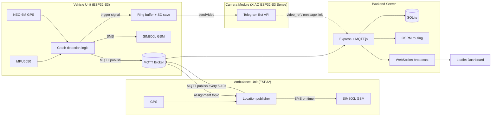

# Architecture — Accident Detection, Alert & Ambulance Navigation System

## Data flow



## Components

- **Vehicle Unit**: detects impacts via MPU6050 threshold logic, reads GPS, alerts via SMS (SIM800L) and MQTT (over its own WiFi hotspot connection), and fires a local trigger to the camera module. All units connect to a WiFi hotspot for data — GSM/SIM800L is used only for SMS, never as an MQTT/data transport.
- **Camera Module**: independent firmware on XIAO ESP32-S3 Sense. Keeps a rolling buffer and, on trigger, writes ~50s of footage to SD, then uploads to Telegram over its own WiFi.
- **Ambulance Unit**: streams GPS location over MQTT (over its own WiFi hotspot connection), sends periodic SMS location via GSM, and receives assignment messages back from the server.
- **Backend Server**: subscribes to MQTT, persists accidents/locations in SQLite, computes nearest-ambulance assignment (haversine pre-filter + OSRM route confirmation), and pushes live updates to the dashboard over WebSocket.
- **Dashboard**: static Leaflet + OSM tile page served by the same Express app; renders accident markers, ambulance markers, and route polylines from OSRM.

## MQTT topics

| Topic | Direction | Payload |
|---|---|---|
| `vehicle/{device_id}/accident` | vehicle → server | accident event (see below) |
| `vehicle/{device_id}/status` | vehicle → server | optional heartbeat |
| `ambulance/{device_id}/location` | ambulance → server | location update |
| `ambulance/{device_id}/assignment` | server → ambulance | assignment result |

### Accident event
```json
{
  "device_id": "VEH-001",
  "timestamp": "2026-09-23T10:15:30Z",
  "lat": 12.9716,
  "lon": 77.5946,
  "event_type": "accident",
  "severity": "high",
  "impact_g": 4.2,
  "video_ref": null
}
```

### Ambulance location
```json
{
  "device_id": "AMB-001",
  "timestamp": "2026-09-23T10:16:00Z",
  "lat": 12.9700,
  "lon": 77.5900,
  "speed_kmh": 40.5,
  "status": "available"
}
```

### Assignment (server → ambulance)
```json
{
  "accident_id": "5e1b...",
  "lat": 12.9716,
  "lon": 77.5946,
  "distance_km": 3.2,
  "eta_minutes": 6.4
}
```

## Assignment algorithm

1. On a new accident, filter ambulances with `status = available` and a known location within `ASSIGNMENT_SEARCH_RADIUS_KM` (straight-line/haversine).
2. Rank candidates by straight-line distance; take the closest.
3. Confirm with an OSRM `/route` call for actual driving distance/ETA (avoids hammering the public OSRM demo server with one call per candidate).
4. Mark the accident `assigned`, the ambulance `assigned`, publish the assignment to `ambulance/{id}/assignment`, and broadcast to the dashboard over WebSocket.

## Running locally

1. Start an MQTT broker (e.g. `docker run -it -p 1883:1883 eclipse-mosquitto`).
2. `cd server && cp .env.example .env && npm install && npm start`.
3. Open `http://localhost:3000` for the dashboard.
4. Point firmware `config.h` files at the broker's address/port.

## Independent connectivity and distance/ETA

The vehicle unit, ambulance unit, and camera module each have their own `WIFI_SSID`/`WIFI_PASSWORD` in their own `config.h` and can be on completely different hotspots — they never need to share a network. Distance and ETA are computed entirely from the GPS lat/lon each device publishes in its own MQTT message; the WiFi network a device is on has no bearing on the calculation.

Two things to get right when the units are on separate hotspots:

- **Broker reachability**: `MQTT_HOST` must be an address reachable from *every* unit's network — a private LAN IP (e.g. `192.168.1.100`) only works if all units share that LAN. For separate hotspots, run the broker somewhere with a public IP/domain (a small cloud VM, or a public test broker for development) so each unit's hotspot can route to it over the internet.
- **Real GPS fixes**: distance will only be meaningful once each device has an actual outdoor GPS lock at its real physical location — two units sitting next to each other on a desk (even on different hotspots) will still report near-identical coordinates, because the calculation is location-based, not network-based.

For production, self-host OSRM with a regional OSM extract (see [OSRM backend docs](https://github.com/Project-OSRM/osrm-backend)) instead of the public demo server, which is rate-limited and unsuitable for continuous use.
